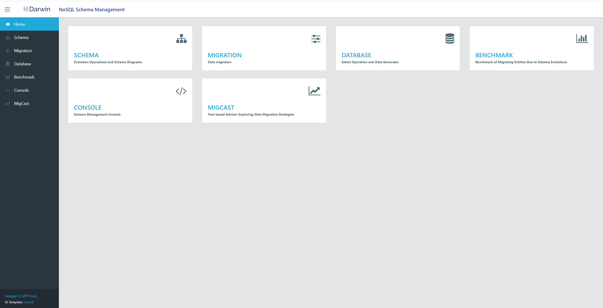
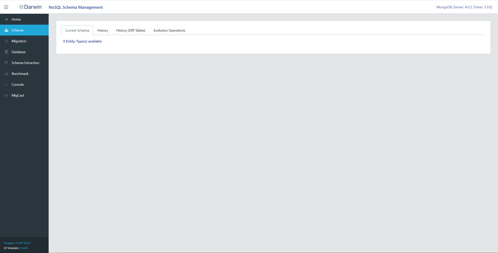
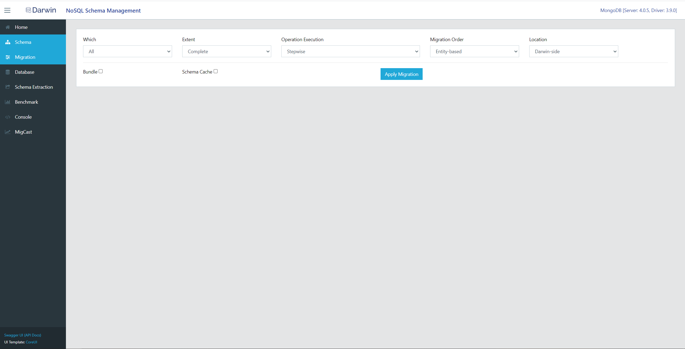
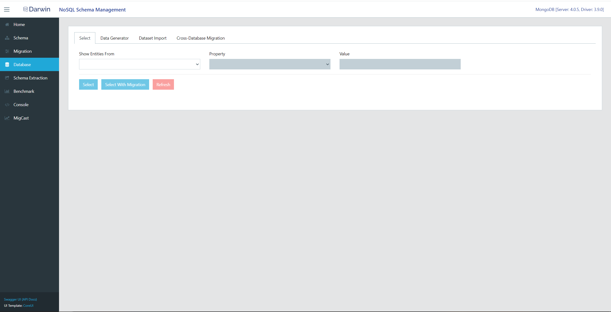
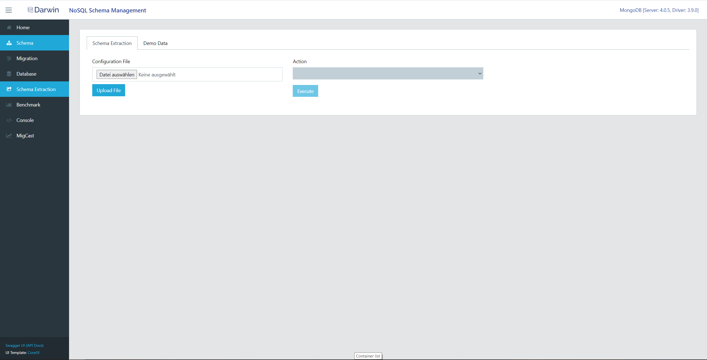
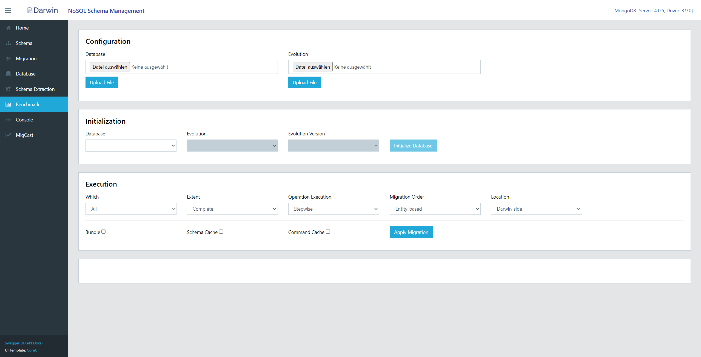
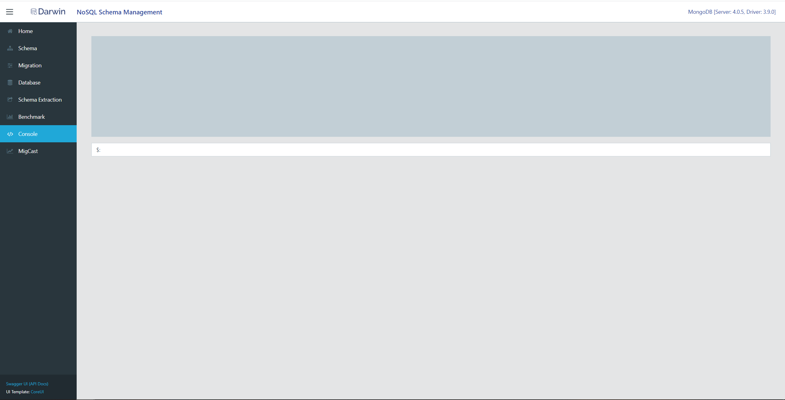
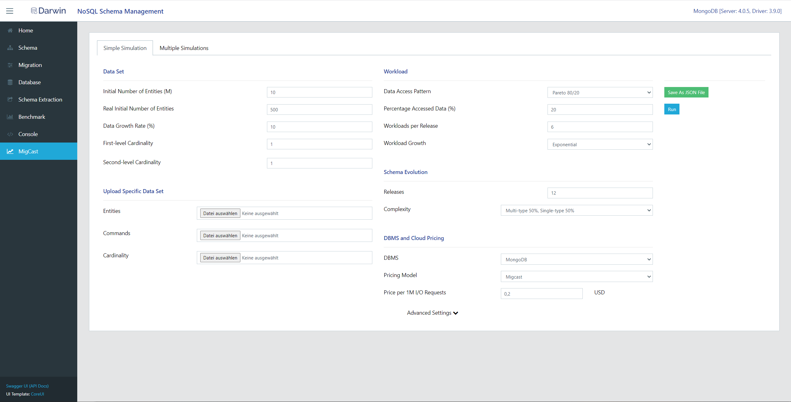

# Darwin

## Introduction

In this project you find the files and information necessary to work with Darwin.
Darwin is a middleware to operate on versioned and evolving data and is mainly concerned with the management and exploration of this data.

Details about the reasons why Darwin exist and algorithms and systems contained within can be found in the corresponding paper [10.1109/ICDE.2018.00187](https://doi.org/10.1109/ICDE.2018.00187).

**! Disclaimer: The Software is largely in a testing state and not yet ready to be used in a productive environment.
This release only serves as a sneak peek version to understand what Darwin is capable of.**

## Requirements
- Docker

## Getting Started

Starting darwin and a preconfigured test database is quite easy. All the necessary information is contained within the docker-compose.yaml file.
To start these containers, all you have to do, is to call the following command while being in the same folder of docker-compose.yaml:

        docker-compose up

After this step you can visit http://localhost:8080/webapp to access Darwin's web frontend.

For further introduction into Darwin visit [Darwin's Homepage](https://sites.google.com/view/evolving-nosql/tools/darwin).
On there you can find videos explaining the components and functionalities of Darwin, with a focus on the MigCast Component.

If you want to shutdown Darwin, just press CTRL + C and then execute

        docker-compose down

to delete the containers.

## Components

### Homescreen

From the homescreen, all other components can be accessed. They are also available on the left side of the screen.

### Schema

The schema screen displays various informations about the current database schema. For example the variables and their datatypes, as well as the history of the schema, and the applied evolution operations.

### Migration

In the migration tab a new migration can be started. For this, many different configuration options concerning the migration can be customized.
After hitting the button "Apply Migration", Darwin will migrate the data to the newest version according to the selected configuration. This can take some time, depending on the amount of data to be migrated.
### Database

From the database screen, data can be selected and viewed, new data can be generated, or data can be imported from external sources.

### Schema Extraction

In the schema extraction screen, the schema of a database defined in an uploaded config file can be extracted and viewed.

For this component a small example is available.
The instructions can be found in the following Video [Darwin and Schema Extraction Tutorial](https://www.youtube.com/watch?v=uhbMVp4nd-w).
The database config file necessary for this example can be found in the schemaextraction_example folder.
The database is already pre-filled with the necessary data, therefore the data import step can be skipped.

### Benchmark

The benchmark tab enables benchmarking for different migration configurations.

### Console

The console is to be used to apply schema evolution commands.

### MigCast

In the MigCast tab, simulations can be executed.
These simulations try to simulate a real workload and schema evolution scenario, and evaluate different parameters to analyze the scenario.

Details about MigCast can be found in the papers [10.1145/3299869.3320223](https://doi.org/10.1145/3299869.3320223) and [2104.11787](https://arxiv.org/abs/2104.11787).

